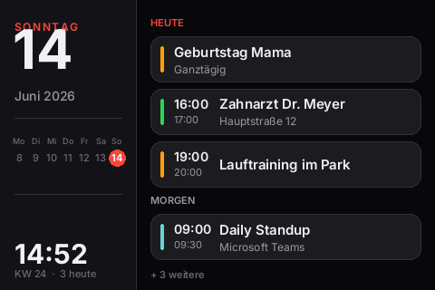

# HomeassistantKalender

Home-Assistant-Kalender auf einem ILI9488-TFT (480×320), betrieben an einem Raspberry Pi Zero 2 W.



## Einrichtung

```bash
cp config.example.py config.py     # Werte eintragen
python3 ha_calendar_display.py     # starten
```

### Vorschau ohne Hardware

```bash
python3 ha_calendar_display.py --preview out.png          # echte Daten
python3 ha_calendar_display.py --preview out.png --demo   # Beispieldaten
```

### Als Dienst

```bash
sudo cp ha-calendar-display.service /etc/systemd/system/
sudo systemctl daemon-reload
sudo systemctl enable --now ha-calendar-display.service
```


